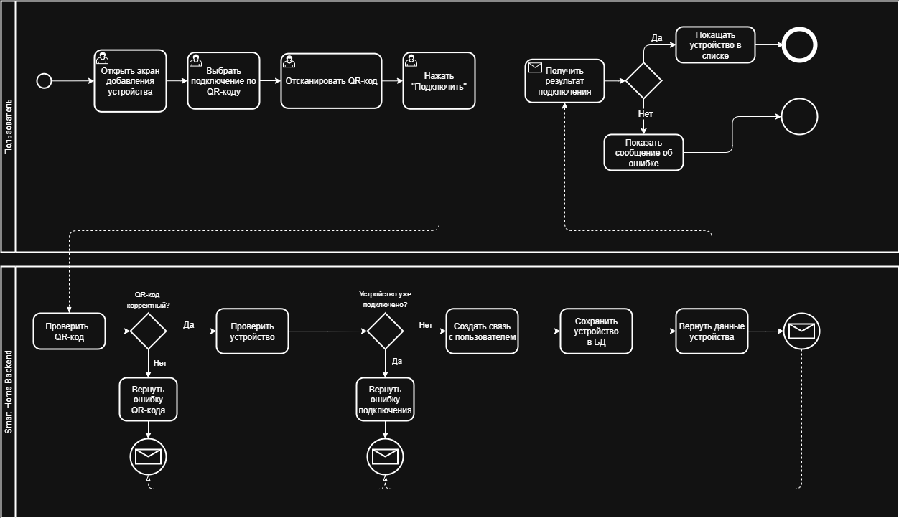

# Add Device

## Назначение

Диаграмма описывает процесс подключения нового устройства к системе Smart Home Management Platform.

---

## Цель процесса

Позволить пользователю добавить устройство умного дома через QR-код и получить возможность управлять им в приложении.

---

## Основные участники

- Пользователь
- Мобильное приложение
- Smart Home Backend

---

## Входные данные

- QR-код устройства
- Данные авторизованного пользователя

---

## Результат

Устройство успешно подключено к учетной записи пользователя и доступно для дальнейшего управления через приложение.

---

## Статус

В работе

---

## Артефакты

- BPMN Diagram (.drawio)
- PNG Preview
- README.md

---

## Диаграмма процесса

---

## Файлы

- [BPMN Diagram](./smart-home_bpmn_add-device.drawio)
- [PNG Preview](./smart-home_bpmn_add-device.png)

---

## Связанные документы

- [Functional Requirements](../../requirements/05-functional-requirements/README.md)
- [User Stories](../../requirements/07-user-stories/README.md)
- [Use Cases](../../requirements/08-use-cases/README.md)
- [Business Rules](../../requirements/09-business-rules/README.md)